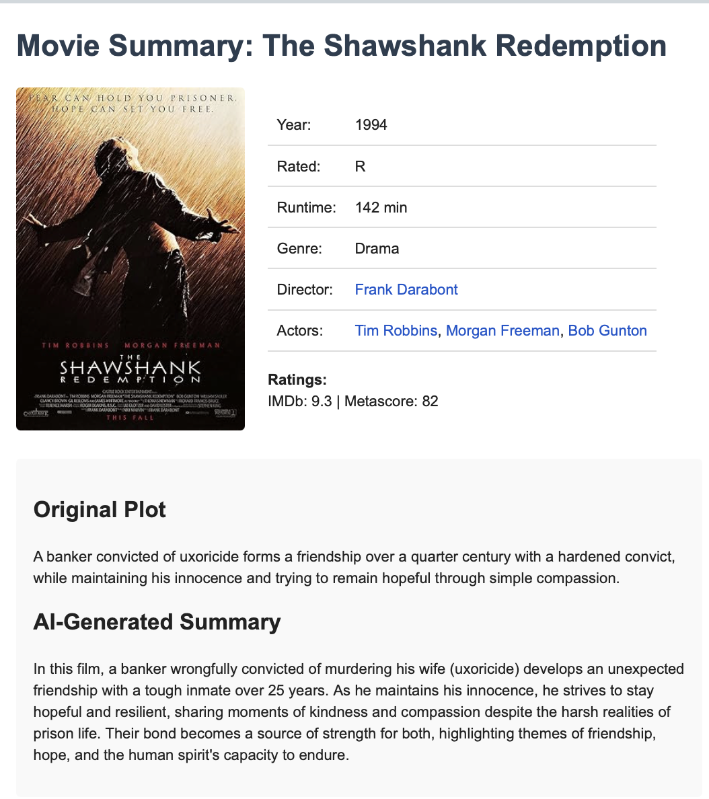

# Movie Summary Service with Inngest

This project implements an event-driven workflow using Inngest that responds to movie watch events by fetching movie information, generating a summary, and sending an email to the specified recipient.

## Features

- **Event-Driven Architecture**: Responds to `meadow_api/movie.watched` events
- **Movie Data Retrieval**: Fetches comprehensive movie information from the OMDb API
- **AI-Powered Summaries**: Uses OpenAI to generate concise plot summaries
- **Email Delivery**: Sends beautifully formatted HTML emails via Resend
- **Robust Error Handling**: Implements comprehensive error handling with appropriate retry logic
- **Delivery Status Tracking**: Monitors email delivery status to ensure successful communication

## Setup Instructions

### Prerequisites

- Python 3.12+
- An Inngest account
- API keys for:
  - OMDb API
  - OpenAI
  - Resend

### Installation

1. Clone this repository:
   ```bash
   git clone https://github.com/peterwnjenga/meadow-coding.git
   cd meadow-coding
   ```

2. Install dependencies:
   ```bash
   pip install -r requirements.txt
   ```

3. Create a `.env` file in the project root with the following variables:
   ```
   OMDB_API_KEY=your_omdb_api_key
   OPENAI_API_KEY=your_openai_api_key
   RESEND_API_KEY=your_resend_api_key
   INNGEST_SIGNING_KEY=your_inngest_signing_key
   ```

### Running the Service

1. Start the application:
   ```bash
   INNGEST_DEV=1 uvicorn main:app --reload
   ```

2. In a separate terminal, start the Inngest dev server:
   ```bash
   npx inngest-cli@latest dev -u http://127.0.0.1:8000/api/inngest --no-discovery
   ```

3. The service will now listen for `meadow_api/movie.watched` events and process them accordingly.

## Usage

Send an event to the Inngest function with the following structure:

```json
{
  "name": "meadow_api/movie.watched",
  "data": {
    "movie_title": "The Matrix",
    "recipient_email": "user@example.com"
  }
}
```

The service will:
1. Fetch movie details from OMDb API
2. Generate a concise summary of the plot using OpenAI
3. Create a formatted HTML email with movie details
4. Send the email to the specified recipient
5. Track delivery status to ensure successful delivery

## Architecture

The project is structured as follows:

- `src/app.py`: Main application entry point
- `src/inngest/client.py`: Inngest client configuration
- `src/inngest/functions.py`: Core function implementation for event handling
- `src/inngest/helpers.py`: Utility functions for API interactions and email generation

## Appropriate Outputs

Below is an example of the email output for "The Shawshank Redemption". Note that the email is mobile responsive.



## Error Handling

The service implements comprehensive error handling:

- **Retriable Errors**: Network issues, rate limits, and temporary service outages trigger automatic retries
- **Non-Retriable Errors**: Invalid inputs, missing data, or permanent failures are logged and reported
- **Email Delivery Tracking**: The service monitors email delivery status to detect bounces or delivery failures

## Testing

Sample test events are provided in the `README.md` file for testing different scenarios:

- Standard movie lookup and email delivery
- Partial title matching
- Invalid email address handling

## Recommendations for Improving the Exercise

1. **Email Domain Configuration**: Configuring the email domains can be tricky, I purchased a throwaway domain and set up the MX and SPF records. It would be better if candidates were provided with a domain that they could use.

## Sample Test Data

### 1. Standard Movie Lookup
```json
{
  "name": "meadow_api/movie.watched",
  "data": {
    "movie_title": "Beetlejuice",
    "recipient_email": "pwn2107@columbia.edu"
  }
}
```

### 2. Partial title matching
```json
{
  "name": "meadow_api/movie.watched",
  "data": {
    "movie_title": "Shawshank",
    "recipient_email": "pwn2107@columbia.edu"
  }
}
```

### 3. Invalid/undeliverable email
```json
{
  "name": "meadow_api/movie.watched",
  "data": {
    "movie_title": "The Godfather",
    "recipient_email": "pwn21xx07@columbia.edxxu"
  }
}
```